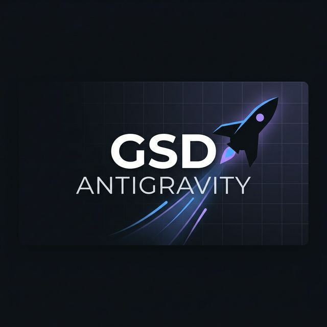

<div align="center">



# GSD Antigravity

**[Get Shit Done](https://github.com/gsd-build/get-shit-done) fork optimized for the [Antigravity](https://deepmind.google/) runtime.**

Meta-prompting, context engineering & spec-driven development — adapted for Antigravity's native tools.

[](https://github.com/JairFC/gsd-antigravity/actions/workflows/ci.yml)
[](LICENSE)
[](https://github.com/gsd-build/get-shit-done)
[](https://www.npmjs.com/package/@jairnx/gsd-antigravity)

</div>

---

## What is this?

A **fork** of [Get Shit Done (GSD)](https://github.com/gsd-build/get-shit-done) by **TÂCHES**, modified and optimized for the **Antigravity** runtime by Google DeepMind.

### Why a fork?

GSD was originally designed for Claude Code and later extended to other runtimes. It works on Antigravity, but with limitations:

- **No `Task()` tool** — Claude's subagent mechanism. In Antigravity everything runs inline.
- **Different tools** — Antigravity uses `view_file`, `grep_search`, `find_by_name`, `write_to_file`, `run_command` instead of `Read`, `Write`, `Grep`, `Glob`, `Bash`.
- **No agent parallelization** — Wave execution runs sequentially.

This fork adapts all 13 Task()-dependent workflows with inline fallbacks, adds project templates, and optimizes instructions for Antigravity's native tools.

---

## Changes from upstream

### ⚡ All 13 Task()-dependent workflows adapted

Every workflow that uses `Task()` subagents now has a `<runtime_check>` block with inline execution instructions for Antigravity:

**Core workflows (detailed inline paths):**

| Workflow | Task() calls | What was added |
|----------|-------------|----------------|
| `new-project` | 7 | Inline research (4 dimensions + synthesis) + inline roadmap |
| `plan-phase` | 4 | Inline researcher, planner, plan-checker, revision loop |
| `execute-phase` | 3 | Sequential inline execution + inline verification |
| `quick` | 6 | Full Step 5-ALT with inline gather → plan → execute → verify |
| `map-codebase` | 4 | Antigravity tool strategies + Analysis Paralysis Guard |

**Secondary workflows (runtime check + inline guidance):**
`audit-milestone`, `diagnose-issues`, `new-milestone`, `research-phase`, `ui-phase`, `ui-review`, `validate-phase`, `verify-work`

### 🆕 Project templates

| Template | Stack | Use case |
|----------|-------|----------|
| `project-go-microservice.md` | Go + Docker + PostgreSQL + Nginx | Backend APIs, microservices |
| `project-network-tool.md` | SSH + SNMP + REST + PostgreSQL | Network management, monitoring |
| `project-infrastructure.md` | Docker Compose + Nginx + Backup | DevOps, VPS configuration |

### 🔧 Installer rebranded

- Banner shows "GSD Antigravity" with TÂCHES attribution
- Default runtime: Antigravity (not Claude)
- All `npx` references point to `@jairnx/gsd-antigravity`

---

## Install

### One command (recommended)

```bash
npx @jairnx/gsd-antigravity --antigravity --global
```

### Update

```bash
npx @jairnx/gsd-antigravity@latest --antigravity --global
```

### From repo (development)

```bash
git clone https://github.com/JairFC/gsd-antigravity.git
cd gsd-antigravity
node bin/install.js --antigravity --global
```

---

## Usage

All standard GSD commands work:

```
/gsd-new-project          # Initialize new project
/gsd-map-codebase         # Map existing codebase
/gsd-discuss-phase 1      # Discuss phase
/gsd-plan-phase 1         # Plan phase
/gsd-execute-phase 1      # Execute phase
/gsd-quick                # Quick ad-hoc task
/gsd-progress             # Check current status
/gsd-help                 # Show all commands
```

For full GSD documentation, see the [original README](https://github.com/gsd-build/get-shit-done).

---

## Credits

This is a **fork** of [Get Shit Done](https://github.com/gsd-build/get-shit-done), created by **[TÂCHES](https://github.com/glittercowboy)** (Lex Christopherson).

The original meta-prompting, context engineering, and spec-driven development system was designed and implemented by TÂCHES. This fork only adapts and optimizes specific components for the Antigravity runtime.

**License:** MIT — See [LICENSE](LICENSE) for details.

---

<div align="center">

*Fork maintained by [JairFC](https://github.com/JairFC)*

</div>
